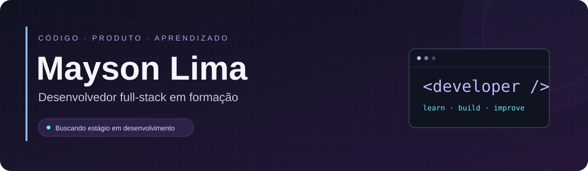

  

  
  
  

<b>ADS · PUC Minas &nbsp; | &nbsp; Acelera Dev · Programadores do Amanhã</b> Jacaraci, Bahia · Inglês intermediário — B1

---

### 👋 Sobre mim

Sou estudante de **Análise e Desenvolvimento de Sistemas na PUC Minas** e participante da **Turma 8 do Acelera Dev**. Construo aplicações web para colocar meus estudos em prática, conectando interfaces, APIs e bancos de dados.

Busco uma oportunidade de **estágio em Desenvolvimento de Software**. Minha experiência em atendimento e suporte administrativo fortaleceu minha comunicação, organização e capacidade de entender as necessidades de quem usa um serviço.

- **Construindo:** Bemmo, uma plataforma para profissionais do bem-estar.
- **Aprofundando:** desenvolvimento full-stack, autenticação, APIs REST e testes.
- **Aprendendo no PdA:** JavaScript, IA aplicada ao desenvolvimento, inglês e habilidades socioemocionais.

### 🛠️ Tecnologias e conhecimentos

**Front-end**

**Back-end e dados**

**Outras linguagens e ferramentas**

APIs REST · Arquitetura em camadas · Scrum

### 🚀 Projetos em destaque

<table>
<tr>
<td width="50%" valign="top">
<h3>🌿 Bemmo</h3>

Plataforma para profissionais do bem-estar, com perfis, serviços, disponibilidade e agendamento online.

<b>React · Node.js · Express · Prisma · PostgreSQL</b>

Em desenvolvimento. O showcase apresenta o produto, a arquitetura e as decisões técnicas; o código principal é privado.

<a href="https://github.com/MaysonLima/Bemmo-Showcase"><b>Explorar showcase →</b></a>
</td>
<td width="50%" valign="top">
<h3>✨ AI Lead Qualifier</h3>

Simulação de qualificação de leads com classificação, pontuação, justificativa e sugestão de abordagem.

<b>React · Node.js · Express · Vite · OpenAI API</b>

Interface integrada à API, com modo demonstrativo local ou integração com a OpenAI.

<a href="https://github.com/MaysonLima/AI-Lead-Qualifier"><b>Explorar código →</b></a>
</td>
</tr>
</table>

🌐 <b><a href="https://maysonlima.github.io/Portfolio-Mayson-Lima-dos-Santos/">Conheça meu portfólio</a></b> — apresentação, trajetória e outros projetos.

### 📚 Formação

| Formação | Instituição | Período |
| :--- | :--- | :--- |
| Análise e Desenvolvimento de Sistemas | PUC Minas | 2026–2028 · em andamento |
| Acelera Dev — Turma 8 | Programadores do Amanhã | Set. 2026–mar. 2027 · em andamento |

<b>Mais sobre minha trajetória</b>

Minha experiência como assistente administrativo na Neoenergia Coelba incluiu a conferência de aproximadamente **8.000 documentos** e a contribuição para mais de **2.000 atendimentos**. Essa vivência me ajuda a pensar em organização de dados, clareza na comunicação e soluções úteis para as pessoas.

Também participei do **Connecta Easy**, projeto acadêmico desenvolvido em equipe para centralizar serviços de provedores de internet, aplicando integração de APIs REST, arquitetura em camadas e Scrum.

### 📊 Atividade no GitHub

Meus commits, contribuições e atividades estão no **gráfico nativo abaixo dos repositórios fixados**. Nos projetos, os READMEs apresentam o que está implementado e os próximos passos.

---

<b>Vamos conversar?</b> Aberto a oportunidades de estágio em Desenvolvimento de Software.  <a href="https://www.linkedin.com/in/maysonlima/">LinkedIn</a> &nbsp; · &nbsp; <a href="mailto:maysonlima021@gmail.com">maysonlima021@gmail.com</a> &nbsp; · &nbsp; <a href="https://maysonlima.github.io/Portfolio-Mayson-Lima-dos-Santos/">Portfólio</a>

